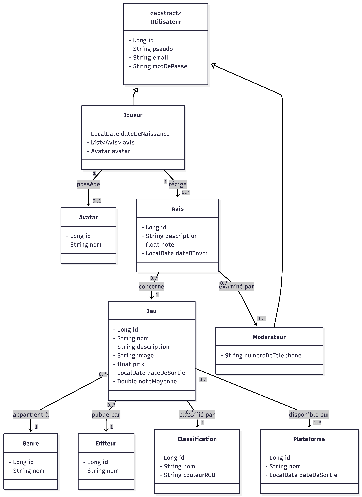
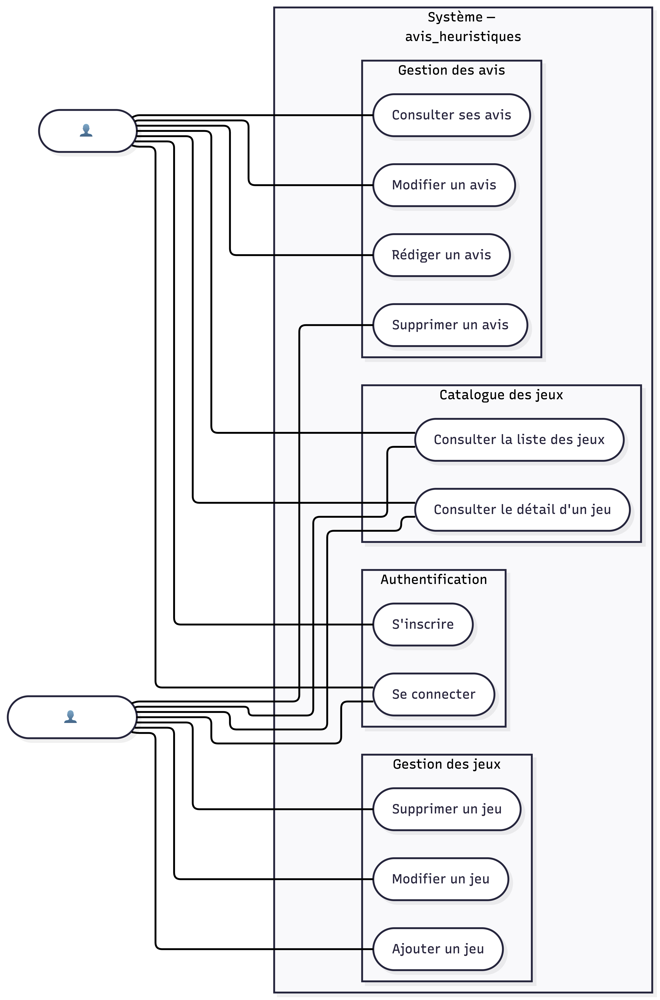
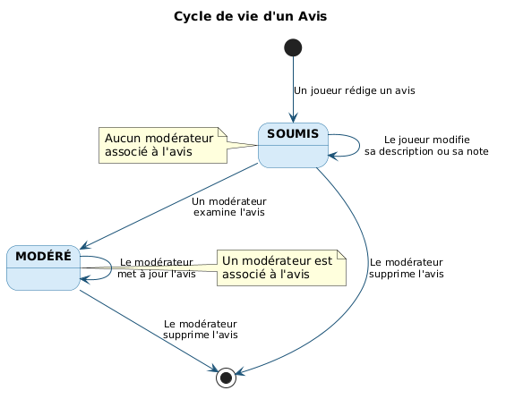
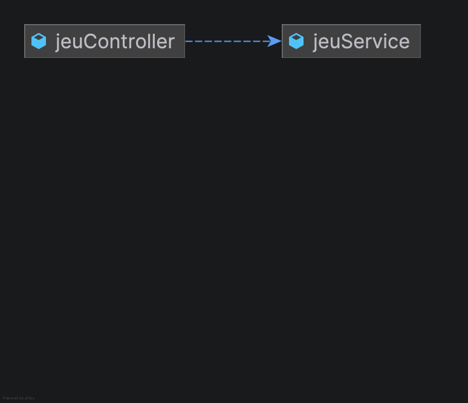
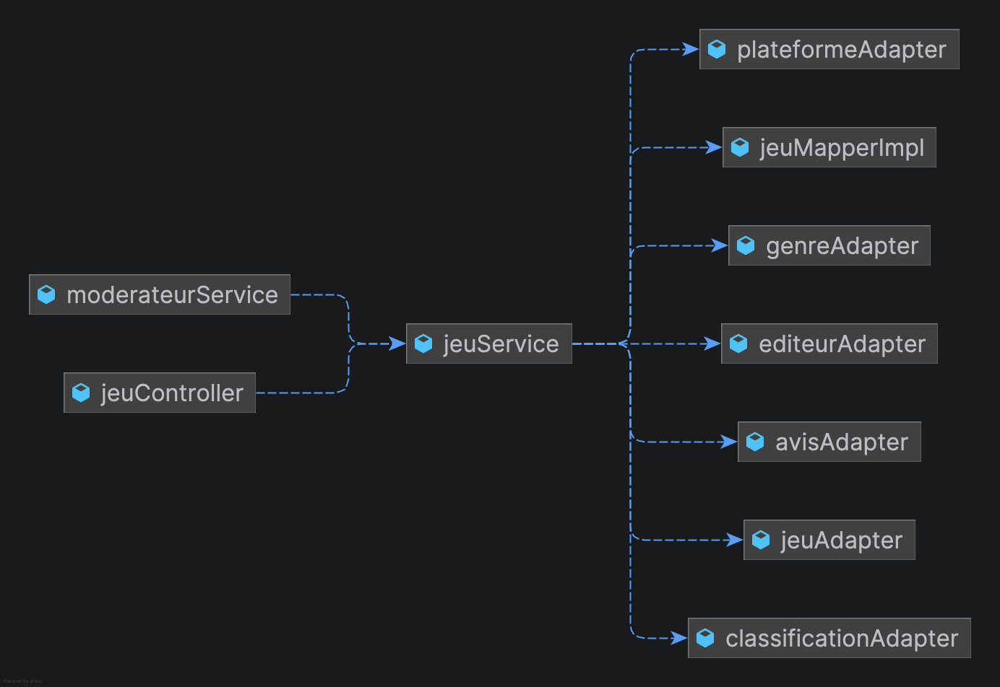

# Dossier Architecture — avis_heuristiques

> Plateforme de notation de jeux vidéo — Backend Spring Boot (Java 25 / Spring Boot 4.0.5)

---

## Table des matières

1. [Choix de l'architecture](#1-choix-de-larchitecture)
2. [Modélisation UML](#2-modélisation-uml)
3. [Outils et techniques](#3-outils-et-techniques)
4. [Diagrammes de beans Spring](#4-diagrammes-de-beans-spring-intellij-idea)
5. [Exemples de code](#5-exemples-de-code)

---

## 1. Choix de l'architecture

### Architecture hexagonale (Ports & Adapters)

Le backend est structuré selon l'**architecture hexagonale**, aussi appelée architecture Ports & Adapters, proposée par Alistair Cockburn.

L'idée centrale est simple : **le domaine métier ne dépend de rien**. C'est le code technique (Spring, JPA, JWT) qui dépend du domaine, et jamais l'inverse.

```
┌─────────────────────────────────────────────────────────┐
│                     INFRASTRUCTURE                      │
│                                                         │
│   Controllers REST        Adapters JPA / JWT            │
│   (adapters entrants)     (adapters sortants)           │
│          │                        ▲                     │
│          ▼                        │                     │
│   ┌─────────────────────────────────────────────┐       │
│   │              PORTS (interfaces)             │       │
│   │   Ports IN (UseCases)   Ports OUT (Ports)   │       │
│   │          │                    ▲             │       │
│   │          ▼                    │             │       │
│   │   ┌───────────────────────────────────┐     │       │
│   │   │          DOMAINE MÉTIER           │     │       │
│   │   │   Jeu, Avis, Joueur, Moderateur   │     │       │
│   │   │   Services (AuthService, ...)     │     │       │
│   │   └───────────────────────────────────┘     │       │
│   └─────────────────────────────────────────────┘       │
└─────────────────────────────────────────────────────────┘
```

### Structure des packages

```
fr.esgi.avis/
├── business/          ← Objets du domaine (Jeu, Avis, Joueur…)
├── port/
│   ├── in/            ← Ports entrants : ce que l'app sait faire (UseCase)
│   └── out/           ← Ports sortants : ce dont l'app a besoin (Port)
├── service/           ← Implémentations des ports entrants
├── dto/
│   ├── in/            ← Données reçues (validation Bean Validation)
│   └── out/           ← Données renvoyées
├── mapper/            ← Conversion domaine ↔ DTO (MapStruct)
├── controller/        ← Adapters entrants HTTP (Spring MVC)
├── infrastructure/
│   ├── entity/        ← Entités JPA
│   ├── repository/    ← Adapters sortants JPA
│   └── security/      ← Filtre JWT, configuration Spring Security
└── exception/         ← Hiérarchie d'exceptions métier
```

### Pourquoi ce choix ?

| Bénéfice | Concrètement dans ce projet |
|---|---|
| **Testabilité** | Les services sont testés avec de simples mocks Mockito, sans démarrer Spring ni la base |
| **Interchangeabilité** | On peut passer de H2 (dev) à PostgreSQL (prod) sans toucher au domaine |
| **Lisibilité** | Chaque couche a une responsabilité unique et clairement délimitée |
| **Évolutivité** | Ajouter un nouvel adapter (ex: GraphQL, Kafka) ne modifie pas les services |

---

## 2. Modélisation UML

### 2.1 Diagramme de classes

Représente les entités du domaine métier et leurs relations.



---

### 2.2 Diagramme de cas d'utilisation

Représente les interactions entre les acteurs et le système.



---

### 2.3 Diagramme d'état-transition — Avis

Représente le cycle de vie d'un objet `Avis`.



Un avis passe par deux états :
- **SOUMIS** : créé par le joueur, aucun modérateur associé
- **MODÉRÉ** : un modérateur a examiné l'avis (`moderateur ≠ null`)

La suppression est réservée au modérateur depuis n'importe quel état.

---

### 2.4 Diagramme de séquence — Ajouter un jeu

Représente le flux complet du use case « Ajouter un jeu ».


Les étapes clés :
1. Le modérateur envoie une requête authentifiée par JWT
2. Spring valide le corps de la requête avant d'entrer dans le code métier
3. Le service vérifie que le modérateur existe en base
4. `JeuService` résout chaque référence (genre, éditeur, classification, plateformes)
5. Le jeu est persisté et la note moyenne calculée (nulle à la création)
6. La réponse `201 Created` est retournée avec le jeu complet

---

## 3. Outils et techniques

| Outil | Rôle |
|---|---|
| **Java 25** | Langage — accès aux records, sealed classes, pattern matching |
| **Spring Boot 4.0.5** | Framework applicatif — IoC, MVC, Security, Data JPA |
| **Spring Security + JWT** | Authentification stateless — token signé HMAC-SHA256, secret externalisé via variable d'environnement |
| **Bean Validation (Jakarta)** | Validation des DTOs d'entrée — `@NotBlank`, `@Email`, `@Size`, `@Min`/`@Max` |
| **MapStruct** | Mapping domaine ↔ DTO généré à la compilation, sans réflexion |
| **Lombok** | Réduction du boilerplate — `@Getter`, `@Setter`, `@Data`, `@AllArgsConstructor` |
| **Spring Data JPA + Hibernate** | Persistence — repositories, requêtes nommées, pagination |
| **H2** | Base en mémoire pour le développement et les tests |
| **PostgreSQL** | Base relationnelle pour la production |
| **JUnit 5 + Mockito** | Tests unitaires et d'intégration (41 tests) |
| **SpringDoc OpenAPI 3** | Documentation API auto-générée sur `/swagger-ui.html` |
| **Spring Boot Actuator** | Healthcheck sur `/actuator/health` |

---

## 4. Diagrammes de beans Spring (IntelliJ IDEA)

Ces diagrammes sont générés automatiquement par IntelliJ IDEA à partir du contexte Spring.
Ils montrent les dépendances **réelles injectées à l'exécution**, ce qui illustre concrètement l'inversion de dépendances.

### 4.1 Dépendance JeuController → JeuService



Le `jeuController` ne connaît que l'interface `JeuUseCase` dans le code source.
À l'exécution, Spring injecte automatiquement `jeuService` qui en est l'implémentation.
Le controller n'a aucune connaissance de la logique métier concrète — il délègue.

### 4.2 Isolation du domaine métier — JeuService



Ce diagramme révèle deux choses importantes :

**Inversion de dépendances** — `jeuService` déclare dans son code des dépendances vers des interfaces (`JeuPort`, `GenrePort`, `AvisPort`…). Spring résout et injecte les implémentations concrètes (`jeuAdapter`, `genreAdapter`, `avisAdapter`…) sans que le service le sache.

**Isolation du métier** — ni `jeuController` ni `moderateurService` ne touchent directement aux adapters ou à JPA. Tout passe par `jeuService`, qui reste le seul point d'entrée vers la logique de gestion des jeux.

---

## 5. Exemples de code

### 5.1 Port entrant — contrat du use case

Le port entrant définit ce que l'application sait faire.
Le domaine ne connaît pas Spring : c'est une simple interface Java.

```java
// port/in/JeuUseCase.java
public interface JeuUseCase {
    JeuDtoOut creerUnJeu(JeuDtoIn dto);
    JeuDtoOut mettreAJourUnJeu(Long id, JeuDtoIn dto);
    JeuDtoOut recupererUnJeuParId(Long id);
    List<JeuDtoOut> recupererTousLesJeux();
    Page<JeuDtoOut> recupererTousLesJeux(Pageable pageable);
    void supprimerUnJeu(Long id);
}
```

### 5.2 Port sortant — abstraction de la persistence

Le port sortant isole le domaine de JPA.
Le service appelle cette interface sans savoir si derrière c'est H2 ou PostgreSQL.

```java
// port/out/JeuPort.java
public interface JeuPort {
    Jeu save(Jeu jeu);
    Optional<Jeu> findById(Long id);
    List<Jeu> findAll();
    Page<Jeu> findAll(Pageable pageable);
    void deleteById(Long id);
}
```

### 5.3 Adapter sortant — implémentation JPA

L'adapter implémente le port sortant en déléguant à Spring Data JPA.
Le domaine n'a aucune connaissance de cette classe.

```java
// infrastructure/repository/JeuAdapter.java
@Repository
public class JeuAdapter implements JeuPort {

    private final JeuJpaRepository jpaRepository;
    private final JeuEntityMapper mapper;

    @Override
    public Jeu save(Jeu jeu) {
        return mapper.toDomain(jpaRepository.save(mapper.toEntity(jeu)));
    }

    @Override
    public Optional<Jeu> findById(Long id) {
        return jpaRepository.findById(id).map(mapper::toDomain);
    }

    @Override
    public Page<Jeu> findAll(Pageable pageable) {
        return jpaRepository.findAll(pageable).map(mapper::toDomain);
    }
}
```

### 5.4 DTO d'entrée avec validation

Les DTOs sont des `record` Java immuables.
Bean Validation garantit que le code métier ne reçoit jamais de données invalides.

```java
// dto/in/JoueurDtoIn.java
public record JoueurDtoIn(

    @NotBlank(message = "Le pseudo est obligatoire")
    @Size(min = 3, max = 30, message = "Le pseudo doit contenir entre 3 et 30 caractères")
    String pseudo,

    @NotBlank(message = "L'email est obligatoire")
    @Email(message = "L'email n'est pas valide")
    String email,

    @NotBlank(message = "Le mot de passe est obligatoire")
    @Size(min = 8, message = "Le mot de passe doit contenir au moins 8 caractères")
    String motDePasse,

    @NotNull(message = "La date de naissance est obligatoire")
    @Past(message = "La date de naissance doit être dans le passé")
    LocalDate dateDeNaissance

) implements Serializable {}
```

### 5.5 Gestionnaire global des erreurs

Un seul point de gestion des erreurs pour toute l'application.
Le frontend reçoit toujours un JSON structuré, jamais de stacktrace.

```java
// controller/GlobalExceptionHandler.java
@RestControllerAdvice
public class GlobalExceptionHandler {

    record ErrorResponse(int status, String error, String message, Instant timestamp) {}

    // Erreurs métier (404, 401, 409…)
    @ExceptionHandler(AvisException.class)
    public ResponseEntity<ErrorResponse> handleAvisException(AvisException ex) {
        return ResponseEntity.status(ex.getHttpStatus())
                .body(new ErrorResponse(
                        ex.getHttpStatus(),
                        HttpStatus.resolve(ex.getHttpStatus()).getReasonPhrase(),
                        ex.getMessage(),
                        Instant.now()));
    }

    // Validation des DTOs → 422
    @ExceptionHandler(MethodArgumentNotValidException.class)
    public ResponseEntity<ErrorResponse> handleValidation(MethodArgumentNotValidException ex) {
        String message = ex.getBindingResult().getFieldErrors().stream()
                .map(FieldError::getDefaultMessage)
                .collect(Collectors.joining(", "));
        return ResponseEntity.status(422)
                .body(new ErrorResponse(422, "Unprocessable Entity", message, Instant.now()));
    }

    // Toute autre erreur → 500 sans détail technique
    @ExceptionHandler(Exception.class)
    public ResponseEntity<ErrorResponse> handleGeneric(Exception ex) {
        return ResponseEntity.status(500)
                .body(new ErrorResponse(500, "Internal Server Error",
                        "Une erreur interne est survenue", Instant.now()));
    }
}
```
