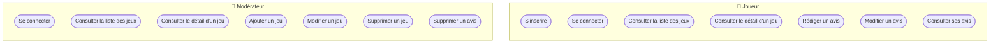

```mermaid
graph TB

    subgraph JOUEUR["👤 Joueur"]
        direction TB
        J1(["S'inscrire"])
        J2(["Se connecter"])
        J3(["Consulter la liste des jeux"])
        J4(["Consulter le détail d'un jeu"])
        J5(["Rédiger un avis"])
        J6(["Modifier un avis"])
        J7(["Consulter ses avis"])
    end

    subgraph MODERATEUR["👤 Modérateur"]
        direction TB
        M1(["Se connecter"])
        M2(["Consulter la liste des jeux"])
        M3(["Consulter le détail d'un jeu"])
        M4(["Ajouter un jeu"])
        M5(["Modifier un jeu"])
        M6(["Supprimer un jeu"])
        M7(["Supprimer un avis"])
    end
```
